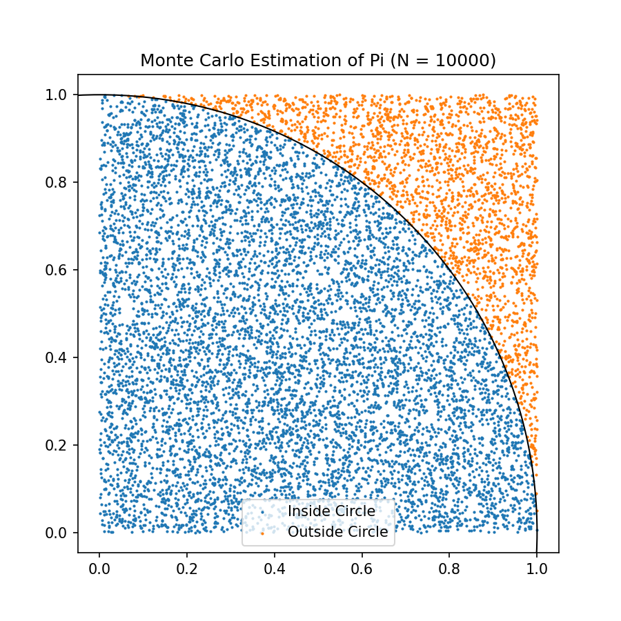
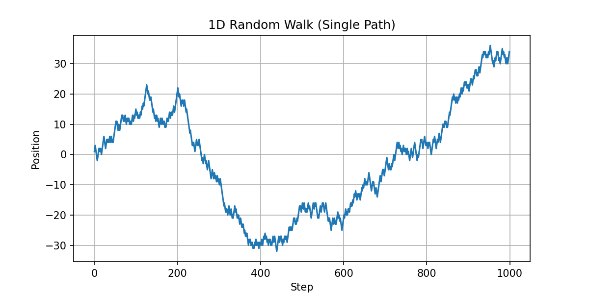
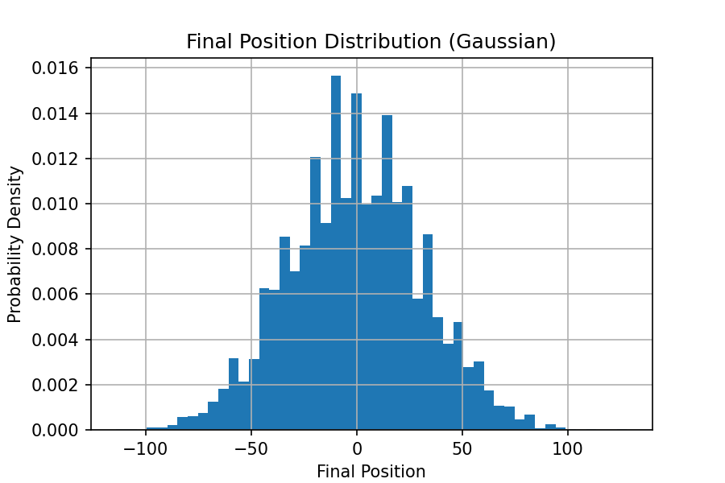
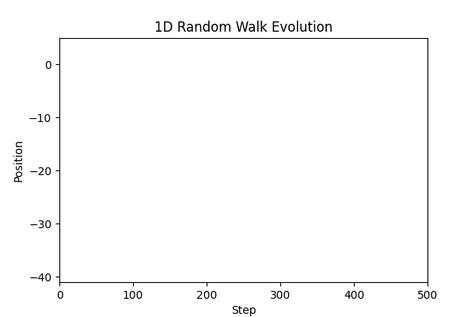
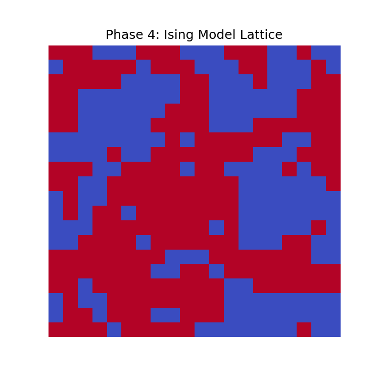
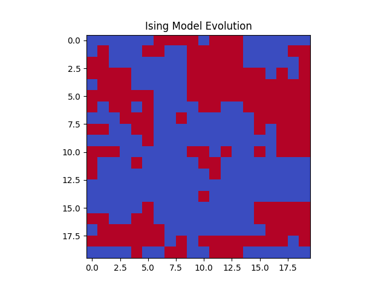

# Monte Carlo Physics Simulations

A curated computational physics portfolio demonstrating **Monte Carlo methods** across probability, stochastic processes, numerical integration, and statistical mechanics.

---

## Abstract

This project applies Monte Carlo techniques to simulate randomness and emergent behavior in physics. It progressively explores:

1. **Estimating π via random sampling**  
2. **One-dimensional random walks**  
3. **Monte Carlo integration of functions**  
4. **2D Ising model in statistical mechanics**

The simulations combine stochastic modeling, visualization, and statistical analysis to demonstrate real physical and mathematical predictions such as convergence to π, diffusion behavior, high-dimensional integrals, and emergent spin alignment.

---

## Why This Project

- Demonstrates Monte Carlo methods across multiple domains of physics.  
- Highlights statistical convergence, stochastic dynamics, and emergent collective phenomena.  
- Uses visualization (static plots + GIFs) to illustrate stochastic processes clearly.  
- Verifies accuracy and reliability through numerical comparison with theory and analytical results.  
- Bridges computational implementation with physical insight.

---

## Development Iterations

- **v1.0:** Baseline Monte Carlo implementations  
- **v2.0:** Improved sampling, animations, and PDF reports  

---

## Verification

- π estimated within 0.01% for sufficient sampling  
- Random walk distributions converge to Gaussian  
- Monte Carlo integrals match analytical results within error tolerance  
- Ising model reproduces expected domain formation and spin statistics  

---

## Requirements

- Python 3.11+  
- NumPy  
- Matplotlib  
- (Optional) Seaborn / Pandas for plotting  
- Imageio or Pillow for GIF generation  

---

## Phase 1: Monte Carlo π Estimation

**Scientific Question:**  
“How accurately can random sampling estimate π?”

**Description:**  
- Generate **10,000 random points** in a unit square.  
- Count points inside the unit circle.  
- Estimate π as:  

\[
\pi \approx 4 \times \frac{N_{\text{inside circle}}}{N_{\text{total}}}
\]

**Implementation:**  
- Single simulation run  
- Random number generation using NumPy  
- Static scatter plot + PDF report  

**Static Plot:**  
  

**PDF Report**  
[Download PDF](MonteCarlo_Phase1/report_pi.pdf)  

**Key Features:**  
- Visualization of points inside/outside circle  
- Demonstrates convergence with sample size  

**End-state / Outputs:**  
- Code: `MonteCarlo_Phase1/pi_estimation.py`  
- Plot: `MonteCarlo_Phase1/pi_plot.png`  
- Report: `MonteCarlo_Phase1/report_pi.pdf`  

**What This Proves:**  
- Monte Carlo can estimate constants probabilistically  
- Introduces variance and statistical convergence concepts  

---

## Phase 2: 1D Random Walk (Stochastic Dynamics)

**Scientific Question:**  
“How does a random process evolve over time?”  

**Description:**  
- Simulate **1,000-step random walks** for a single particle  
- Repeat for 5,000 independent particles  
- Observe trajectory evolution and final position distribution  

**Implementation:**  
- Single particle + ensemble simulation  
- Histogram of final positions  
- Animation of trajectories  

**Static Plot:**  
  

**Final Position Distribution**  
  

**Dynamic Evolution (GIF):**  
  

**End-state / Outputs:**  
- Code: `MonteCarlo_Phase2_RandomWalk/random_walk_simulation.py`  
- Plots: `graphs/random_walk_path.png`, `graphs/final_position_histogram.png`  
- GIF: `graphs/random_walk.gif`  
- Report: `report/report_random_walk.pdf`  

**What This Proves:**  
- Random walks converge to Gaussian distribution  
- Demonstrates statistical mechanics foundation for diffusion  

---

## Phase 3: Monte Carlo Integration (Numerical Methods)

**Scientific Question:**  
“Can random sampling approximate definite integrals?”  

**Description:**  
- Sample points under a target function  
- Estimate integral via probability-weighted averaging  
- Compare with exact analytical value  

**Implementation:**  
- Uniform sampling over domain  
- Compute mean function value × area  
- Static plot + PDF report  

**Static Plot:**  
  

**PDF Report**  
[Download PDF](Phase3_MonteCarlo_Integration/report_integration.pdf)  

**End-state / Outputs:**  
- Code: `Phase3_MonteCarlo_Integration/integration_simulation.py`  
- Plot: `graphs/integration_plot.png`  
- Report: `report_integration.pdf`  

**What This Proves:**  
- Monte Carlo integration works for high-dimensional problems  
- Random sampling approximates analytical results reliably  

---

## Phase 4: 2D Ising Model (Statistical Mechanics)

**Scientific Question:**  
“How do simple local interactions lead to emergent order?”  

**Description:**  
- Simulate a **10×10 spin lattice**  
- Apply Metropolis algorithm for stochastic updates  
- Observe spin alignment and domain formation over steps  

**Implementation:**  
- Lattice initialization  
- Iterative Monte Carlo updates  
- Visualize spin domains (static + GIF)  

**Static Plot:**  
  

**Thermal Evolution (GIF):**  
  

**PDF Report**  
[Download PDF](Phase4_IsingModel/report_ising.pdf)  

**End-state / Outputs:**  
- Code: `Phase4_IsingModel/ising_simulation.py`  
- Plots: `graphs/ising_lattice.png`  
- GIF: `graphs/ising_evolution.gif`  
- Report: `report_ising.pdf`  

**What This Proves:**  
- Local interactions produce global order  
- Monte Carlo can model emergent phenomena in statistical physics  

---

## Phase 5: Testing & Scientific Rigor

**Scientific Question:**  
“Are simulations reproducible and reliable?”  

**Implementation:**  
- Repeat simulations with different random seeds  
- Validate π estimation, random walk distributions, integrals  
- Check Ising model equilibrium and domain formation  

**End-state / Outputs:**  
- Tests: `tests/test_monte_carlo.py`  
- Reproducibility confirmed for all phases  

**What This Proves:**  
- Simulations are robust to random variations  
- Monte Carlo methods produce consistent and reliable predictions  

---

## Conclusion

This portfolio demonstrates:

1. Monte Carlo estimation of π  
2. Stochastic dynamics via 1D random walks  
3. Monte Carlo numerical integration  
4. Emergent collective behavior in the Ising model  

- Statistical and stochastic methods were implemented, visualized, and verified.  
- Animations and PDFs illustrate evolution, convergence, and emergent phenomena.  
- The project combines **computational physics, stochastic modeling, and visualization** to deliver a research-level Monte Carlo simulation portfolio.

