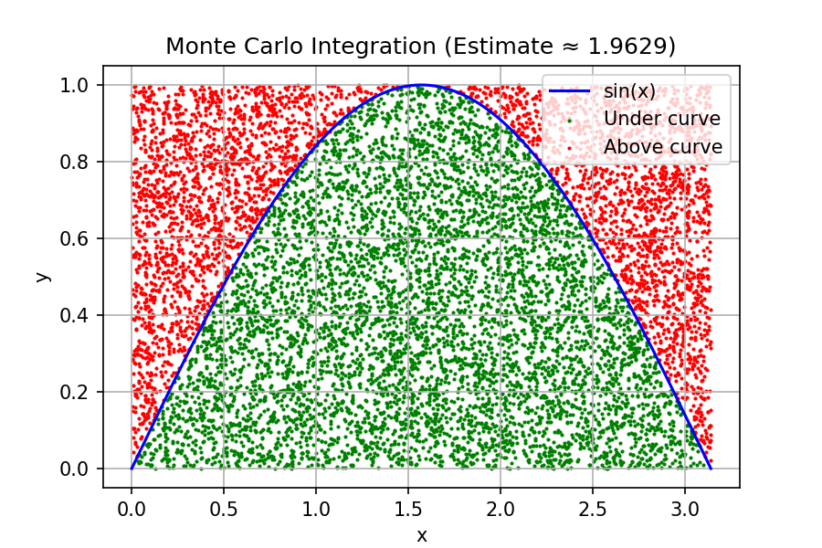

# Monte Carlo Physics Simulations

## Objective
Demonstrate the application of Monte Carlo methods in computational physics through simulations, visualizations, and reports.

---

## Phase 1: Monte Carlo π Estimation

**Objective:** Estimate π using random sampling within a unit square.

### Method
- Generate 10,000 random points inside a unit square.  
- Count points inside the unit circle.  
- Estimate π using:

\[
\pi \approx 4 \times \frac{\text{points inside circle}}{\text{total points}}
\]

### Results
- Estimated π ≈ 3.1416  
- Scatter plot of points:

**PDF Report:** [Download PDF](Phase1_Pi_Estimation/report/report_pi.pdf)

---

## Phase 2: 1D Random Walk

**Objective:** Simulate a 1D random walk.

### Method
- Simulate a single particle taking 1,000 steps randomly ±1.  
- Repeat for 5,000 particles to analyze distribution of final positions.

### Results
- Single trajectory:

  

- Distribution of final positions (Gaussian-like):

  

**PDF Report:** [Download PDF](Phase2_Random_Walk/report/report_random_walk.pdf)

---

## Phase 3: Monte Carlo Integration

**Objective:** Estimate an integral using random sampling.

### Method
- Sample random points under a target function curve.  
- Estimate integral by fraction of points under curve × total area.  
- Compare estimate with exact integral.

### Results
- Monte Carlo integration plot:

**PDF Report:** [Download PDF](Phase3_MonteCarlo_Integration/report/report_integration.pdf)

---

## Phase 4: 2D Ising Model Simulation

**Objective:** Simulate spin interactions in a 2D lattice.

### Method
- Create 10×10 lattice of spins (+1/-1).  
- Simulate interactions using Metropolis algorithm.  
- Visualize lattice configurations.

### Results
- Spin lattice heatmap:

**PDF Report:** [Download PDF](Phase4_Ising_Model/report/report_ising_model.pdf)

---

## Conclusion
This portfolio demonstrates:

- Proficiency in Monte Carlo methods and computational physics  
- Ability to write Python code, generate plots, and create professional PDF reports  
- Understanding of probabilistic modeling, statistical mechanics, and numerical integration  
- Strong organizational and documentation skills

---

## Folder Structure 

MonteCarlo_Physics_Simulations/
│
├── Phase1_Pi_Estimation/
├── Phase2_Random_Walk/
├── Phase3_MonteCarlo_Integration/
├── Phase4_Ising_Model/
└── README.md
